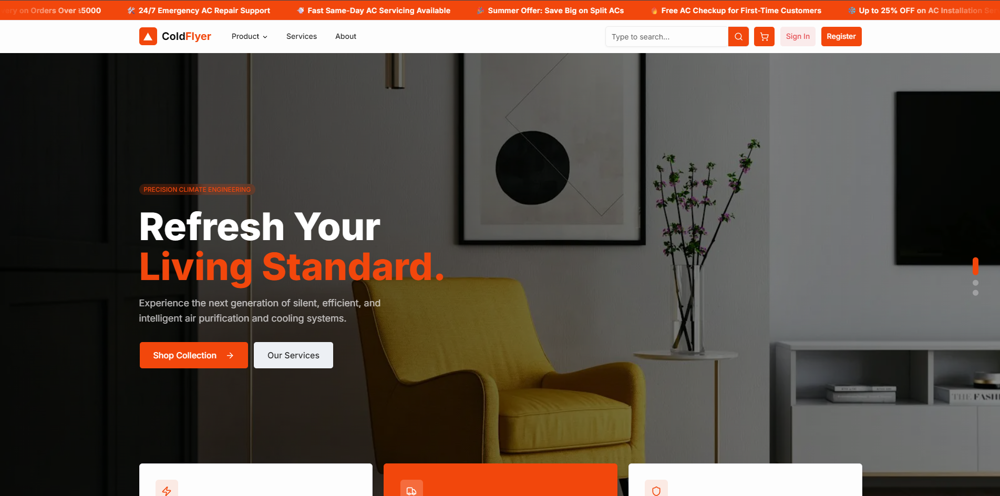

# Cold Flyer

Modern AC service booking and AC parts marketplace built with **Next.js 16** (App Router) and a headless **Express.js + MongoDB** backend.

> **Live:** [https://coldflyer.vercel.app](https://coldflyer.vercel.app)



---

## Highlights

| Area | What It Shows |
|------|---------------|
| **Full-Stack Architecture** | Next.js 16 App Router frontend → Express API proxy → MongoDB backend. Clean separation of concerns. |
| **Real E-Commerce Flow** | Product catalog → cart → checkout → Stripe/SSLCOMMERZ payment → order management. End-to-end. |
| **Service Booking System** | Date/time scheduling, AC tech assignment, multi-step booking form with guest + logged-in modes. |
| **Admin Dashboard** | 15+ CRUD modules, role-based access (admin/moderator/worker/customer), real-time analytics charts. |
| **Authentication & Security** | JWT httpOnly cookies, Google OAuth, bcrypt, rate limiting, account lockout, Helmet CSP, CORS. |
| **i18n + Dark Mode** | Full English/Bengali locale, system-respecting theme toggle. |
| **Clean Code Practices** | Component decomposition, server actions, React Query hooks, Zod validation, consistent linting/formatting. |
| **Monorepo Structure** | Two independent packages with shared conventions — pnpm frontend, npm backend. |

---

## Features

| Module | Details |
|--------|---------|
| **Product Catalog** | Browse AC units, parts & accessories with search, filters, categories, and sorting |
| **Shopping Cart & Checkout** | Full cart flow with Stripe + SSLCOMMERZ payment gateways, coupon codes |
| **AC Service Booking** | Browse services, book appointments with date/time picker, manage bookings |
| **Admin Dashboard** | Analytics (charts), orders, products, services, bookings, users, workers, customers, coupons, blogs, expenses, attendance, messages, reporting |
| **Authentication** | JWT single access token — email/password + Google OAuth |
| **Demo Login** | One-click demo login — instantly try as a customer with pre-seeded data |
| **Internationalization** | English + Bengali (bn) locale via next-intl |
| **Dark Mode** | System-respecting theme toggle via next-themes |
| **Animated UI** | Framer Motion animations, Embla Carousel, scroll-reveal presets |

---

## Demo Accounts

Run `npm run seed` in the backend to seed these accounts:

| Role | Email | Password |
|------|-------|----------|
| Admin | `admin@coldflyer.com` | `Admin@1234` |
| Moderator | `mod@coldflyer.com` | `Mod@1234` |
| Worker | `tech@coldflyer.com` | `Tech@1234` |
| Customer | `fatima@example.com` | `User@1234` |

Click **Demo Login (Customer)** on the auth page to instantly log in as a customer.

---

## Tech Stack

| Category | Technology |
|----------|-----------|
| **Framework** | Next.js 16.2.4 (App Router, Turbopack), React 19 |
| **Styling** | Tailwind CSS v4, shadcn/ui (radix-vega), Lucide icons |
| **State** | Zustand (cart), React Query / TanStack Query (server state) |
| **Forms** | React Hook Form + Zod validation |
| **i18n** | next-intl (en, bn, `localePrefix: "never"`) |
| **Animation** | Framer Motion, Embla Carousel |
| **Tables** | TanStack Table |
| **Charts** | Analytics dashboard with real-time charts |
| **Backend** | Express.js + MongoDB / Mongoose |
| **Payments** | Stripe, SSLCOMMERZ |
| **Package Manager** | pnpm |

---

## Project Structure

```
src/
├── app/
│   ├── (public)/          # Public routes — landing, items, services, cart, auth, blog, etc.
│   ├── (dashboard)/       # Admin/Moderator/Worker dashboard routes
│   └── api/[...path]/     # API proxy → Express backend
├── components/
│   ├── auth/              # Auth page, sign-in/sign-up forms
│   ├── checkout/          # Checkout flow (address picker, payment, summary)
│   ├── dashboard/         # Dashboard components (bookings, orders, products, blogs, etc.)
│   ├── detail/            # Product & service detail pages
│   ├── home/              # Landing page sections (hero, promo, blogs, services)
│   ├── layout/            # Navbar, footer, sidebar, providers
│   ├── products/          # Product cards, catalog, info tabs, offer banner
│   └── ui/                # shadcn/ui primitives (button, input, dialog, tabs, etc.)
├── hooks/                 # Custom hooks (use-auth-form, React Query hooks)
├── lib/                   # Utilities (actions, http-client, auth-server, animation, utils)
├── messages/              # i18n translation files (en/, bn/)
└── validations/           # Zod schemas (auth, coupon, etc.)
```

---

## Getting Started

```bash
# 1. Clone
git clone https://github.com/devabutaher/cold-flyer.git
cd cold-flyer/cold-flyer

# 2. Install
pnpm install

# 3. Create .env.local
#     NEXT_PUBLIC_API_URL=http://localhost:5000
#     NEXT_PUBLIC_SITE_URL=http://localhost:3000
#     NEXT_PUBLIC_GOOGLE_CLIENT_ID=your_google_client_id

# 4. Start backend first (see cold-flyer-server/)
cd ../cold-flyer-server
npm install && npm run seed
npm start

# 5. Start frontend
cd ../cold-flyer
pnpm dev
```

---

## Scripts

| Command | Description |
|---------|-------------|
| `pnpm dev` | Start dev server (Turbopack) |
| `pnpm build` | Production build |
| `pnpm start` | Start production server |
| `pnpm lint` | Run ESLint |
| `pnpm format` | Format with Prettier |

---

## Dashboard

The dashboard provides a full administrative interface at `/dashboard`:

- **Analytics** — Charts for revenue, orders, bookings, user growth, and service performance
- **Orders** — Manage customer orders, update status, view details
- **Products** — CRUD for AC units and parts
- **Services** — CRUD for service offerings
- **Bookings** — Manage service appointments, confirm/schedule/complete
- **Users** — Manage all user accounts and roles
- **Workers** — Manage worker profiles and assignments
- **Customers** — View customer history and booking patterns
- **Coupons** — Create and manage discount codes
- **Blogs** — Write and manage blog posts
- **Expenses** — Track business expenses
- **Attendance** — Worker attendance tracking
- **Messages** — In-app messaging system

---

## Links

- **Live:** [https://coldflyer.vercel.app](https://coldflyer.vercel.app)
- **Repository:** [https://github.com/devabutaher/cold-flyer](https://github.com/devabutaher/cold-flyer)
- **Backend API:** [https://cold-flyer-server.onrender.com](https://cold-flyer-server.onrender.com)

---

## License

MIT
